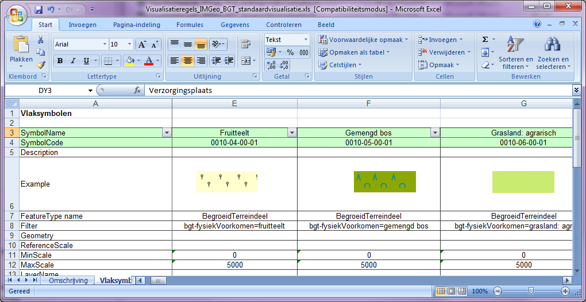

1.  Inleiding

    1.  Deze versie

De Handreiking Visualisatieregels beschrijft hoe BGT/IMGeo objecten op een kaart
weergegeven kunnen worden.

In deze versie 2.1 van de Handreiking is de Lijngerichte visualisatie vervangen
door de “Pastelvisualisatie”.

Verschillende visualisaties
---------------------------

De visualisatie is geen onderdeel van een informatiemodel, maar is een apart
aspect. De gegevenscatalogus bevat de objectdefinities; de visualisatie van deze
objecten wordt buiten de gegevenscatalogus beschreven in visualisatieregels, die
zijn vastgelegd in de bijlagen. In elke visualisatieregel is ook vastgelegd van
welke selectie van objecten dit de visualisatie is. Er zijn vijf visualisaties
gerealiseerd:

-   **Standaardvisualisatie**: een visualisatie voor het gebruik van de
    BGT/IMGeo-inhoud als hoofdthema, die aansluit bij de visualisatie van de
    Basisregistratie Topografie (BRT). In de standaardvisualisatie worden alleen
    de puntsymbolen voor CADO, verkeersdrempel en kering toegepast. Omwille van
    de visuele hiërarchie wordt met klem geadviseerd om de icoonvisualisatie van
    IMGeo puntobjecten NIET af te beelden in combinatie met de
    standaardvisualisatie.

-   **Achtergrondvisualisatie**: een visualisatie voor het gebruik van de
    BGT/IMGeo-inhoud als achtergrondkaart, die aansluit bij de visualisatie van
    de BRT-Achtergrondkaart zoals die is gerealiseerd voor Publieke
    Dienstverlening op de Kaart (PDOK).

-   **Omtrekgerichte visualisatie**: een visualisatie voor het gebruik van de
    BGT/IMGeo-inhoud als hoofdthema, die aansluit bij de visualisatie van de
    Grootschalige Basiskaart Nederland (GBKN). Alle individuele objecten worden
    apart gevisualiseerd. De begrenzingen tussen de individuele objecten blijven
    gehandhaafd.

-   **Icoonvisualisatie**: een visualisatie van de puntsymbolen voor het gebruik
    van de IMGeo-inhoud, die aansluit bij de hiervoor genoemde
    achtergrondvisualisatie. Omwille van de visuele hiërarchie wordt met klem
    geadviseerd om de icoonvisualisatie NIET af te beelden in combinatie met de
    standaardvisualisatie.

-   **Pastelvisualisatie**: een visualisatie voor het gebruik van de
    BGT/IMGeo-inhoud als achtergrondkaart, die aansluit bij de behoefte van
    civiel-technische ingenieursbureaus en de kabels- en leidingenketen om
    informatie over haar infrastructuur af te beelden op de BGT/IMGeo-inhoud.

Alleen met betrekking tot de visualisatie van teksten wordt in de
gegevenscatalogus iets gezegd. Dit is nodig omdat deze zaken al door de
bronhouders in acht moeten worden genomen wil uiteindelijk een te genereren
kaartbeeld van de BGT landelijk op een uniforme wijze worden gepresenteerd.

Er is bij het vaststellen van de visualisatie geen onderscheid gemaakt tussen
verplichte objecten die zijn vastgelegd in de Basisregistratie Grootschalige
Topografie (BGT) en de overige objecten die zijn vastgelegd in het
Informatiemodel Grootschalige Topografie (IMGeo).

Visualisatieregels
------------------

De vijf visualisaties die zijn gerealiseerd zijn vastgelegd in een bepaalde,
voorgeschreven vorm volgens de template visualisatie die Geonovum heeft
opgesteld in combinatie met de Handreiking Visualisatie. Het template bevat
bovendien een toelichting op de ingevulde velden.

De template bevat de volgende onderdelen:

-   Sheet 1: Omschrijving: Geeft een uitleg van alle eigenschappen van symbolen
    die in de template te vinden zijn. De uitleg bevat onder andere een
    Nederlandse vertaling van het begrip, een omschrijving, en een voorbeeld
    afbeelding.

-   Sheet 2: Vlaksymbolen: Het deel van de template waar je de
    visualisatieregels staan beschreven voor objecten die met een vlaksymbool
    worden gevisualiseerd.

-   Sheet 3: Lijnsymbolen: Idem voor lijnsymbolen

-   Sheet 4: Puntsymbolen: Idem voor puntsymbolen

-   Sheet 5: Tekstsymbolen: Idem voor tekstsymbolen

-   Sheet 6: Standaarden: Geeft een overzicht van symbool kenmerken in SLD, KML
    en SVG èn geeft aan welke symbool kenmerken (in bepaalde omstandigheden)
    worden afgeraden in het kader van de richtlijn voor goede webcartografie.

Voor elk van de vijf visualisaties is er een Excel bestand met daarin de
visualisatieregels voor alle objecttypen. Bij elke regel is een voorbeeld
opgenomen van hoe het object eruit komt te zien als het gevisualiseerd wordt.

Figuur : Voorbeeld vlaksymbolen uit de template met visualisatieregels

Daarnaast zijn er technische bestanden, die direct ingelezen kunnen worden in
geo-webservices en diverse GIS pakketten, beschikbaar in Styled Layer Descriptor
(SLD) formaat. De iconen zijn gepubliceerd in Scalable Vector Graphics (SVG)
formaat en zijn tevens in EPS en PNG formaat beschikbaar.

Het kan zijn dat voor het visualiseren van een groep objecten meerdere symbolen
gebruikt worden, bijvoorbeeld een vlak-, lijn- of puntsymbool in combinatie met
een tekstsymbool. In deze gevallen wordt er op meerdere sheets een
visualisatieregel opgenomen: één voor vlak, lijn, of punt, en één voor de tekst.

Inbedding
---------

De visualisatie van de Basisregistratie Grootschalige Topografie (BGT) die hier
wordt gepresenteerd sluit aan bij het “Huisstijlhandboek Cartografie voor te
drukken en printen media v.3” van 1 Logo en de “Handreiking Visualisatie v.1”
van Geonovum.

De template is gebaseerd op de Styled Layer Descriptor (SLD) 1.1. standaard van
het Open Geospatial Consortium (OGC)[^1]. Dit is een open standaard en wordt
ondersteund door een breed scala aan geografische informatiesystemen (GIS) en
services, waarmee kaarten op het Web kunnen worden gepubliceerd. Hierdoor is er
geen afhankelijkheid van een specifieke softwareleverancier en wordt aangesloten
bij internationale standaarden voor visualisatie.

[^1]: OGC Styled Layer Descriptor Profile of the Web Map Service Implementation
Specification, \#05-078r4,
http://portal.opengeospatial.org/files/?artifact\_id=22364
