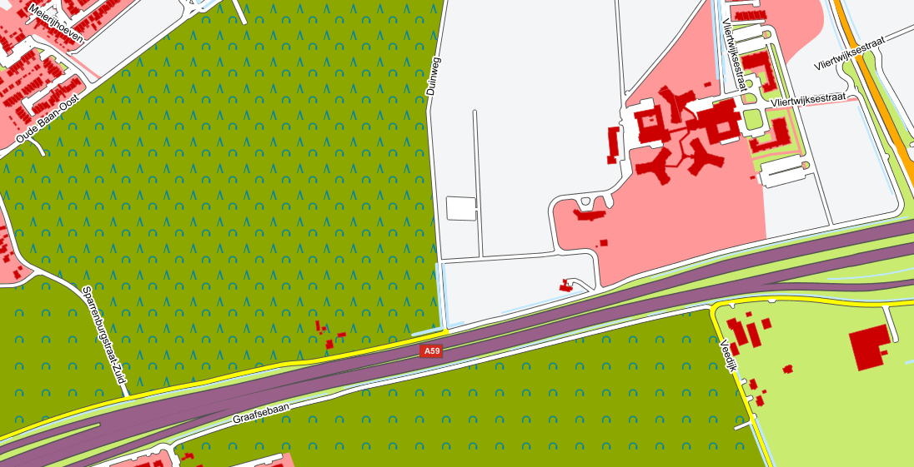

# Visualisatie van de objecttypen

## Transport

### Wegdeel 

Het objecttype “Wegdeel” wordt gevisualiseerd op basis van het attribuut
“bgt-functie”. De verschillende rijbaandelen worden niet afgebakend door harde
lijnen, waardoor een rustiger kaartbeeld ontstaat. Om deze visualisatie te
realiseren, wordt de geometrie van het objecttype 2 maal in de visualisatie
getekend:

1.  De eerste keer voor de wegranden

2.  De tweede keer voor de wegvulling

Voor specifieke toepassingen kan het wenselijk zijn om de verschillende wegdelen
over de standaard visualisatie af te beelden.

[Figuur: Wegdelen gevisualiseerd op basis van het attribuut "bgt-functie".](media/fig-wegdelen-gevisualiseerd-op-basis-van-het-attribuut-bgt-functie.png)

### OndersteunendWegdeel

Het objecttype “Ondersteunend Wegdeel” wordt gevisualiseerd op basis van het
attribuut “bgt-functie”. De objecten krijgen ook een lijnsymbool mee in dezelfde
kleur als het vlaksymbool om te voorkomen, dat er dunne, witte lijnen tussen de
objecten blijven.

### Spoor

Het objecttype “Spoor” wordt gevisualiseerd op basis van het attribuut
“bgt-functie” . Om deze visualisatie te realiseren, wordt de geometrie van het
objecttype 2 maal in de visualisatie getekend:

1.  De eerste keer voor het doorlopende lijnsymbool

2.  De tweede keer voor het gestreepte lijnsymbool

De visualisatie van het objecttype is gelijk voor de standaard- en
achtergrondvisualisatie.

## Terreindeel

### OnbegroeidTerreindeel

Het objecttype “OnbegroeidTerreindeel” wordt gevisualiseerd op basis van het
attribuut “bgt-fysiekvoorkomen”. De objecten met de attribuutwaarden “Erf”,
“Gesloten verharding”, “Open verharding” en “Half verhard” worden twee maal
afgebeeld: als lijnsymbool en als vlaksymbool.

De objecten met de attribuutwaarden “Onverhard” en “Zand” krijgen zowel een
vlaksymbool als ook een lijnsymbool mee in dezelfde kleur als het vlaksymbool om
te voorkomen, dat er dunne, witte lijnen tussen de objecten blijven.

### Begroeid Terreindeel

Het objecttype “Begroeid Terreindeel” wordt gevisualiseerd op basis van het
attribuut “bgt-fysiekvoorkomen”. De objecten krijgen ook een lijnsymbool mee in
dezelfde kleur als het vlaksymbool om te voorkomen, dat er dunne, witte lijnen
tussen de objecten blijven.

De vlakpatronen voor de standaardvisualisatie worden meegeleverd als Scalable
Vector Graphics (SVG) bestanden.

## Water

### Waterdeel en Ondersteunend Waterdeel

Het objecttype “Waterdeel” wordt gevisualiseerd op basis van het attribuut
“bgt-type”. De objecten krijgen ook een lijnsymbool mee in dezelfde kleur als
het vlaksymbool om te voorkomen, dat er dunne, witte lijnen tussen de objecten
blijven.

## Bouwwerk

### Pand

Het objecttype “Pand” wordt gevisualiseerd in alle visualisaties. In de
standaard visualisatie krijgen de objecten zowel een vlaksymbool als een
lijnsymbool mee, waardoor de individuele panden kunnen worden onderscheiden.

In de achtergrondvisualisatie krijgen de objecten ook een lijnsymbool mee in
dezelfde kleur als het vlaksymbool om te voorkomen, dat er dunne, witte lijnen
tussen de objecten blijven. Hier kunnen de onafhankelijke panden niet worden
onderscheiden.

### OverigBouwwerk

Het objecttype “OverigBouwwerk” wordt gevisualiseerd op basis van het attribuut
“bgt-type” en “plus-type”.

### Kunstwerk

Het objecttype “Kunstwerkdeel” wordt gevisualiseerd op basis van het attribuut
“bgt-type” en “plus-type”. De verschillende objecten met de attribuutwaarde
“Perron” worden niet afgebakend door harde lijnen, waardoor een rustiger
kaartbeeld ontstaat. Om deze visualisatie te realiseren, wordt de geometrie van
het object 2 maal in de visualisatie getekend:

1.  De eerste keer voor de wegranden

2.  De tweede keer voor de wegvulling

De Overbruggingsdelen en Tunneldelen worden wel gevisualiseerd, maar er wordt
geen onderscheid gemaakt in het type Overbruggingdeel of type Tunneldeel.

Let op: voor de Pastelvisualisatie worden de Overbruggingsdelen twee maal
getekend. Zo worden met name de pijlers duidelijk zichtbaar. Zie hoofdstuk 5
voor meer informatie.

### Scheiding en Overige Scheiding

Het objecttype “Scheiding” wordt gevisualiseerd op basis van het attribuut
“bgt-type” of “plus-type”. In de achtergrondvisualisatie wordt het objecttype
niet gevisualiseerd.

## Functioneel gebied
Het objecttype “Functioneel gebied” is onderdeel van de standaardvisualisatie.
Het objecttype “Functioneel gebied” wordt voor de standaardvisualisatie
gevisualiseerd op basis van het attribuut “bgt-type” of “plus-type” door middel
van een vlaksymbool (waarbij slechts de grens van het functioneel gebied wordt
afgebeeld) en een puntsymbool. Een puntsymbool wordt getoond in het centrum van
het deel van een polygoon, dat op het beeldscherm zichtbaar is. Een vlaksymbool
zou objecten binnen een functioneel gebied overlappen. De puntsymbolen worden in
een aparte SLD aangeboden, zodat zij bovenop alle andere lijn-, punt- en
tekstsymbolen kunnen worden afgebeeld. Deze puntsymbolen zijn meegeleverd als
Scalable Vector Graphics (SVG) bestanden.

De objecten met de attribuutwaarde “Waterbergingsgebied” en “Kering” hebben
naast het doorgetrokken lijnsymbool van de grens ook een extra lijnsymbool. Dit
wordt gerealiseerd op basis van een geometrische driehoek uit het Truetype
lettertype “Symbol”.

1.  Registratief gebied

    1.  Openbare ruimte

Het objecttype “Openbare Ruimte wordt gevisualiseerd zonder gebruik te maken van
de verschillende attributen.

### Buurt

Het objecttype “Buurt” wordt gevisualiseerd zonder gebruik te maken van de
verschillende attributen.

### Stadsdeel

Het objecttype “Stadsdeel” wordt gevisualiseerd zonder gebruik te maken van de
verschillende attributen.

### Wijk

Het objecttype “Wijk” wordt gevisualiseerd zonder gebruik te maken van de
verschillende attributen.

### Waterschap

Het objecttype “Waterschap” wordt gevisualiseerd zonder gebruik te maken van de
verschillende attributen.

## Vegetatie-object

### Vegetatie-object

Het objecttype “Vegetatie-object” wordt alleen in de standaardvisualisatie
gevisualiseerd op basis van het attribuut “plus-type”. De bomen krijgen een
puntsymbool, de heggen een vlaksymbool of lijnsymbool.
